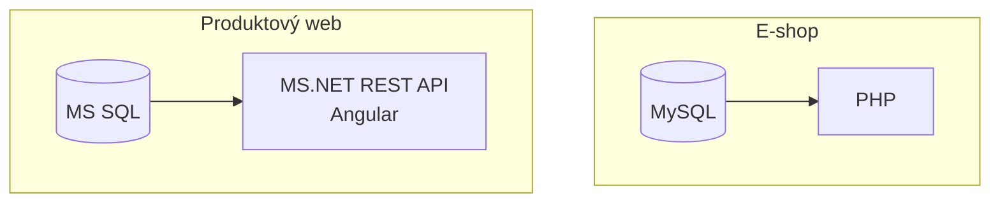
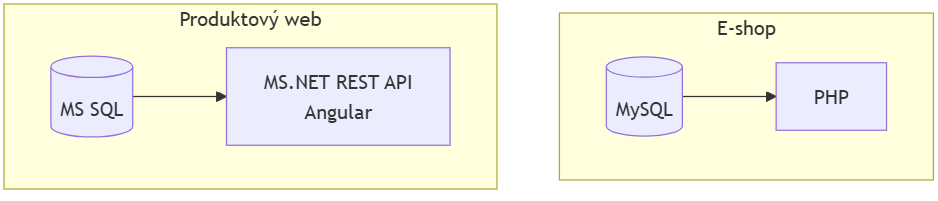
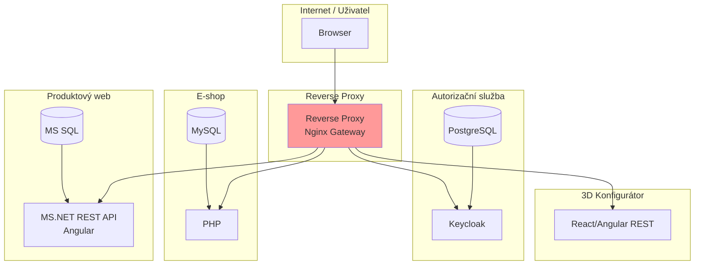
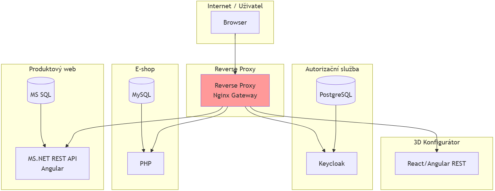
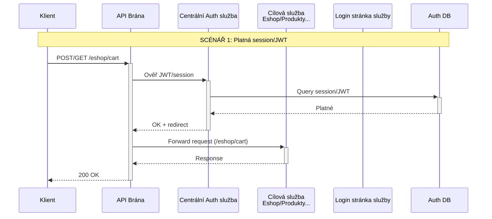
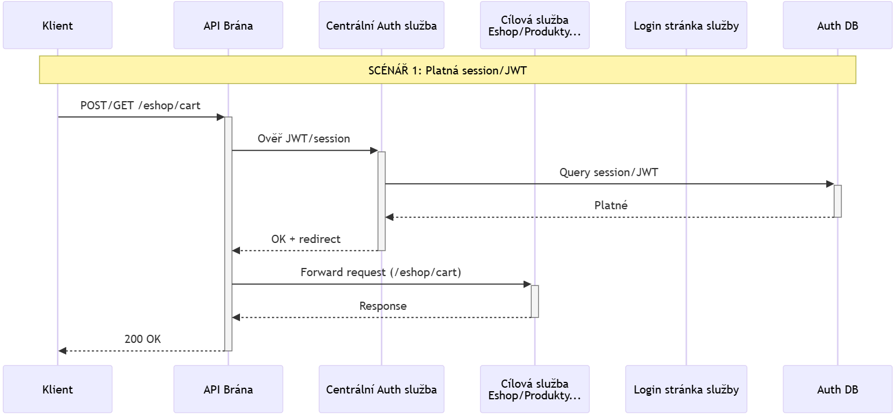
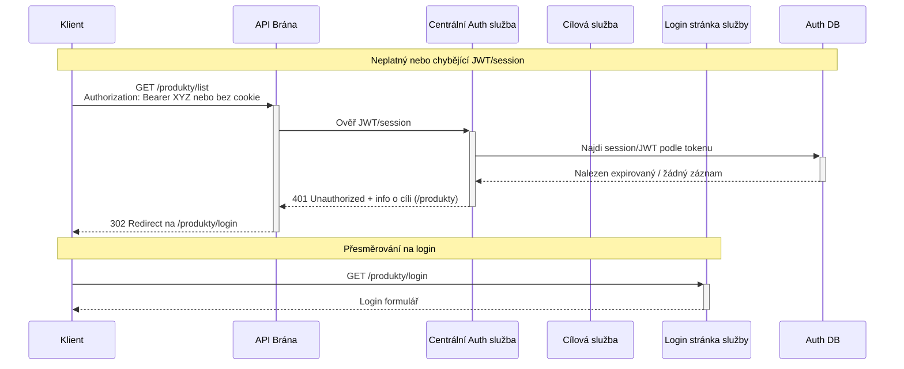
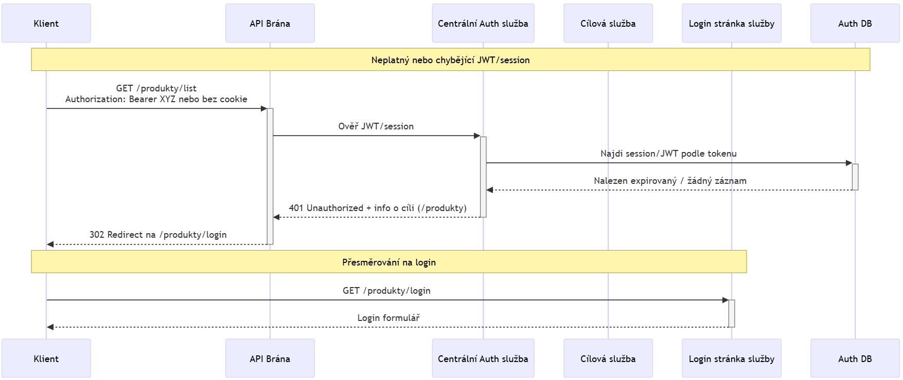

# Návrh centralizované správy uživatelů

Práce byla vyhotovena zadarmo pro konkrétní společnost v rámci výběrového řízení jako zkušební úloha. 
Společnost projevila uznání a spokojenost s prací tímto emailem:

```
Rád bych zdůraznil, že Vaše technické znalosti a zkušenosti hodnotíme velmi pozitivně.
```

K uzavření dohody nedošlo.

# Zadání

Jako klient disponujeme třemi službami typu B2C (např. store.klient.com) a
klasickým prezentačním webem (klient.com). Tyto platformy fungují na různých technologiích a
každá z nich má vlastní systém správy uživatelských účtů (username a heslo). Aktuálně
připravujeme nový systém 3D konfigurátoru, ke kterému budou tito uživatelé také potřebovat
přístup.

Navrhněte způsob centralizované správy uživatelských účtů, která umožní využití
stávajících uživatelských profilů z existujících systémů pro přístup k novému 3D konfigurátoru,
bez nutnosti zakládání nového profilu do každé služby / aplikace zvlášť.

- Architektonické očekávání:
  - Autentizace musí být řešena centrálně
  - Řešení má být připraveno na budoucí rozšíření o další aplikace a služby

# Poznámky autora ke zpracování

- Část informací v tomto dokumentu je převzata, případně odvozena z informací v zadání, které bylo poskytnuto

# Současný stav

V současné době je cílová platforma složena z těchto systémů:

1. B2C e-shop
2. Prezentační produktový web

Dále je v záměru vyvinout 3D konfigurátor produktů.




## B2C e-shop

- Technologie: PHP (legacy řešení, převážně custom kód)
- Databáze: MySQL
- Autentizace:
  - Přihlášení pomocí e-mailu nebo uživatelského jména a hesla
  - Hesla jsou historicky ukládána pomocí různých hashovacích algoritmů (např. MD5, bcrypt)
  - Systém nepodporuje SSO ani externí identity providery

- Uživatelská data:
  - Neexistuje globální identifikátor uživatele použitelný napříč systémy
  - U části starších účtů chybí ověřený e-mail nebo jsou data nekompletní

- Technická omezení:
  - E-shop je dlouhodobě v produkčním provozu
  - Zásahy do přihlašovací logiky jsou možné pouze v omezeném rozsahu (riziko regresí)

## Prezentační produktový web

- Frontend: Angular (SPA aplikace)
- Backend: .NET REST API
- Databáze: MS SQL
- Autentizace:
  - Vlastní registrační a přihlašovací mechanismus
  - Přihlášení pomocí e-mailu a hesla
  - Moderní hashování hesel
- Uživatelská data:
  - Produktový web má samostatnou uživatelskou databázi, která je zcela nezávislá na e-shopu
  - Uživatelé si zde mohou vytvořit účet výhradně pro účely práce s obsahem (např. ukládání konfigurací, poptávek, oblíbených produktů), aniž by měli nebo potřebovali účet v e-shopu
  - V případě shodného e-mailu se stále jedná o odlišné účty v různých systémech
- Funkční využití účtu:
  - Ukládání konfigurací a poptávek
  - Přístup k personalizovanému obsahu

## 3D konfigurátor produktů (záměr)

Aplikace je zmíněna v této chvíli jako budoucí záměr.

- Typ aplikace: samostatná webová aplikace (SPA)
- Technologie:
  - Frontend: moderní JavaScript framework (např. React / Angular)
  - Backend: REST nebo GraphQL API
- Požadavky na autentizaci:
  - Přístupný pouze přihlášeným uživatelům
  - Musí umožnit využití stávajících uživatelských účtů z e-shopu i produktového webu
  - **Nesmí obsahovat vlastní správu uživatelů**
- Integrace:
  - Konfigurátor bude dostupný:
    - z e-shopu (např. z detailu produktu),
    - z produktového webu,
    - případně i samostatně přes přímý vstup (URL)

# Záměr cílového stavu

Na základě současného stavu a zjištěných požadavků bude v této kapitole naznačen v obecné rovině rámcový záměr budoucího cílového stavu.

## Návrh architektury





V rámci projektu bude nasazena **API brána (Nginx Reverse Proxy)** s **centrální autentizační službou** (Keycloak a PostgreSQL), která bude **předřazena před všechny requesty** do původních aplikací (e-shop, produktový web, v budoucnu 3D konfigurátor).

**Předpokládané dosažené cíle řešení:**
- **Žádné změny v aplikacích** (například v e-shopu)
- Prostor pro **centralizované logování a monitoring** všech requestů
- Prostor pro **zvýšení bezpečnosti** (například TLS, firewall, rate limiting)

## Proces

1. **API brána** zachytí každý request a předá ho **centrální autentizační službě**
2. **Při aktivním přihlášení** (platná session/JWT - ověří si je ve své DB) přesměruje do konkrétní služby
3. **Bez přihlášení přesměruje na login** specifický pro cílovou službu (/eshop/login, /produkty/login), kterou určí z URI zachyceného požadavku
4. Po **úspěšném** přihlášení z jakékoli služby tato služba vytvoří potřebný **JWT** nebo **PHPSESSID** a také **autentizační služba** zapíše do DB data v obecném dekodovaném formátu tak, aby z nich byla podle potřeby schopná sestavit JWT token (nebo jiný datagram) pro jinou technologii v budoucnu

**Výsledek:** Vznikne obdoba Single Sign-On (SSO) přes ekosystém bez nutnosti refaktoringu kódu aplikací.

### Platná session/JWT





### Neplatný/chybějící JWT/session





## 3D konfigurátor produktů

Konfigurátor produktů bude očekávat pro klienta aktivní **JWT token**. Pokud jej nezíská, uživatel bude přesměrován na novou přihlašovací obrazovku (zajistí ji autorizační služba), která převezme data od uživatele (email a heslo) a provede s nimi kontroly, které odpovídají logice ověřování v **e-shopu** a **produkt webu**. Bude fungovat tak, že ověří oba dva zdroje paralelně (logika z aplikací bude zkopírována, pokud nebude možné na straně aplikace provolat endpoint - **nedostatek informací u produktového webu**) a v případě aspoň jedné shody sestaví **JWT token**. Pro e-shop navíc **PHPSESSID**, protože PHP e-shop pravděpodobně neumí **JWT** zpracovávat. Obsahem JWT tokenu budou data o právech z konkrétního systému, který potvrdil shodu přihlašovacích údajů.

V případě registrace nového uživatele, bude uživatel přesměrován na registraci do **produkt webu**, protože je tato služba nejmodernější a konfigurátor sám podle požadavku nebude mít samostatnou databázi uživatelů.

# Technické požadavky

## Zvolené technologie

- **Reverse proxy (API brána)**  
  Nginx - představuje prověřený, z hlediska využítí zdrojů efektivní, rychlý a vysoce výkonný server. Bude použit pro řízení směrování požadavků uživatelů na služby. Zajistí přesměrování na centrální autorizaci pro nepřihlášené uživatele. Pokud kterékoli službě chybí zabezpečené spojení, API brána umožňuje dokonfigurovat TLS bez zásahu do služby a posílit tak bezpečnost
- **centrální autentizační služba**  
  Keycloak - je standardním v komerčním prostředí využívaným IAM open-source řešením pro federaci identit a jednotné přihlášení. Obsahuje velké množství integračních konektorů, které řeší protokoly jako například SAML, OAuth2, JWT tokeny. Stejně tak je schopen integrovat i jednotlivé databáze uživatelů na úrovni přímého čtení DB (**User Storage Provider SPI**). S ohledem na požadavek nezasahovat do služeb toto považuji za zajímavé.
  MFA se v rámci Keycloak konfiguruje v Realm Settings > Authentication > Flows, kde je možné vybrat z metod jako TOTP, WebAuthn nebo e-mail OTP, případně SMS  
  PostgreSQL - ověřená open-source bezplatná serverová DB, která je přibližně o 10% výkonnější než MySQL. Keycloak v případě potřeby umí pracovat také s MySQL/MariaDB.

## Funkční požadavky

- Uživatel musí být nadále schopen využívat služby podle toho ve kterém systému je registrován
- Pomocí účtu v současných systémech musí uživatel být schopen přistoupit k budoucímu 3D konfigurátoru
- 3D konfigurátor bude k dispozici volně i bez přihlášení
- Systém ověří uživatele emailem a heslem
- Registrace nových uživatelů budou nadále probíhat podle systému, který si uživatel zvolí

## Nefunkční požadavky

- Autentizace musí být řešena centrálně
- Řešení počítat s budoucím rozšířením o další aplikace a služby
- Centralizovaná autentizace s 99,9% dostupností, pastavená na OAuth2 a JWT tokenech
- MFA pro všechny přístupy, audit logy
- API brána bude obsluhovat a řídit veškerý provoz v systému (kontrolou stavu přihlášení a předávání requestů na služby od uživatelů do serverů služeb)

# Výzvy a rizika

## Bezpečnost

- Slabé šifrovací algoritmy zůstávají přítomné v systému (v důsledku požadavku na zachování e-shopu beze změn)
- Nedostupnost služeb v nové architektuře (chyba konfigurace sítě nebo směrovacích pravidel a filtrů na reverse proxy)
- Pokud z dat z e-shopu vznikne **JWT** pro **konfigurátor**, může dojít bez refresh mechanismu k impersonaci při úniku DB, protože e-shop nemá prostředky na řízení platnosti **JWT**

## Provoz a dostupnost

- Single Point of Failure (autorizační služba) - všechny requesty projdou přes řetězec Nginx -> Autorizační služba -> Postgre. Výpadek Postgre zablokuje celý ekosystém, včetně e-shopu. Řešením by byl záložní přechod (fallback) na lokální session, která v e-shopu je a zůstane zachována (byla by však nutná větší konfigurace právě na API bráně).
- Rate limiting a monitoring: Nginx má prostor pro firewall/rate-limit, ale bez bližší specifikace metrik tohoto bodu bude otevřený brute-force útoku na služby (avšak stav je stejný jako u jednotlivých služeb bez reverse proxy)

## Datová rizika

- Při budoucím rozvoji a sdílení uživatelských bází systémů napříč ekosystémem může dojít k nesprávnému sdílení dat mezi účty, porušení uděleného GDPR souhlasu nebo rozsahu tohoto uděleného souhlasu (použití souhlasu pro jinou oblast).
- Ukládání v PostgreSQL bude nešifrované nebo bude řešeno slabou šifrou. Existuje zde riziko úniku dat přes stránkovací soubor nebo RAM v případě selhání v oddělených adresních prostorech procesů v operačním systému serveru
- 3D konfigurátor bude bez vlastní DB - při spoléhání na **JWT** tokeny z jiných systémů existuje riziko, že práva nebo role v systémech budou změněny, ale uživatel díky ještě platnému tokenu bude dočasně pracovat s širší sadou práv než mu od určitého okamžiku náleží.

## Rizika škálování a technického řešení

- PHP, .NET a JavaScript jako doposud zmíněné technologie každé pracují se svým standardem přihlášení (PHPSESSID a navržené JWT). Autorizační služba musí zajistit validní PHP session v kontextu staršího PHP pro e-shop. Existuje riziko, že e-shop může být náchylný k CSRF útoku, případně session fixation (záleží na verifikačních pravidlech za jakých byl vyvinut).

# Uživatelská zkušenost

Návrh předpokládá, že uživatelská zkušenost nebude negativně dotčena. Bude nadále možné využívat uživatelské účty, které už uživatelé mají bez nutnosti zásahu z jejich strany. Integrovaný systém bude z pohledu uživatele nadále využívat stejné přihlašovací obrazovky, jako byli zvyklí doposud.

Navržené řešení však otevírá cestu k vyšší bezpečnosti systému jako celku, ale zároveň ji nezbytně nevynucuje. Implementaci lze provést i později (například MFA a další kroky ověření).

V případě nového 3D konfigurátoru je zmíněný proces složitější a u této služby bude použita jednotná přihlašovací obrazovka, kterou bude třeba dokonfigurovat s úpravou CSS stylu a použitím konfiguračních voleb na straně **Keycloak**, aby obrazovka vyhovovala grafickému vizuálu. Je možné, že některé části komunikace s uživatelem budou potřebovat úpravu jazykových řetězců.

## Minimalizace dopadů na uživatele

Z rozboru předpokládané uživatelské zkušenosti vyplývá, že je možné body, které mají negativní dopad na uživatele (především bezpečnost - **MFA**) zavádět později, případně nezavádět vůbec. Avšak je potřeba zmínit, že bezpečnost obecně za jisté mírné nepohodlí pro uživatele (jeden ověřovací krok, případně údaj v systému navíc) stojí.

# Migrace a implementace

## Migrace

Datová migrace v systému nebude podle návrhu probíhat.

## Implementace

(poznámka autora: pro ilustraci volím on premise přístup)

1. Pořízení nebo určení fyzického HW (serveru) - Doporučená konfigurace: 32 GB RAM, CPU 6 fyzických jader, SSD disk 80 GB a více
2. Instalace systému platformy Linux (například distribuce Alpine (velikost do 500 MB), případně Debian nebo Red Hat)
3. Instalace **Podman** a **Kubernetes** na fyzický systém
4. V rámci **iptables** je třeba provést konfigurací podsítí, omezit otevřené protokoly a porty na fyzickém systému
5. Doplnění balíčku **fail2ban** a konfigurace k posílení bezpečnosti fyzického systému
6. V rámci **Podman** a **Kubernetes** provést přípravu definic sady služeb (soubor **compose.yml**) s definicí jednotlivých celků (NGinx, Keycloak)
7. Služby, které nelze kontejnerizovat, budou ponechány na serverech, na kterých jsou. Měl by však být proveden audit způsobu zálohování a přezkoušet způsobilost prováděných záloh k obnově po havárii na izolované prázdné instamci systému. Tyto služby NGinx server umí obsluhovat, pokud budou servery řádně zasíťovány
8. NGinx, Keycloak mají rozsáhlé dokumentace s příklady konfigurací, podle kterých je možno postupovat (poznámka autora: dle zadání nebude dokument tento bod více řešit)
