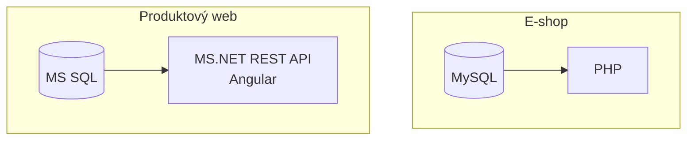
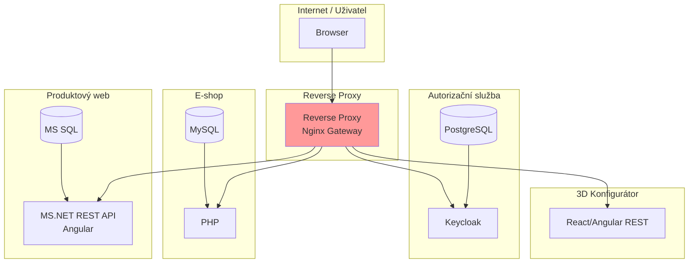

# Návrh centralizované správy uživatelů

# Zadání

Jako klient disponujeme třemi službami typu B2C (např. store.klient.com) a
klasickým prezentačním webem (klient.com). Tyto platformy fungují na různých technologiích a
každá z nich má vlastní systém správy uživatelských účtů (username a heslo). Aktuálně
připravujeme nový systém 3D konfigurátoru, ke kterému budou tito uživatelé také potřebovat
přístup.

Navrhněte způsob centralizované správy uživatelských účtů, která umožní využití
stávajících uživatelských profilů z existujících systémů pro přístup k novému 3D konfigurátoru,
bez nutnosti zakládání nového profilu do každé služby / aplikace zvlášť.

# Poznámky autora ke zperacování

- Část informací v tomto dokumentu je převzata, případně odvozena z informací v zadání, které bylo poskytnuto

# Současný stav

V současné době je cílová platforma složena z těchto systémů:

1. B2C e-shop
2. Prezentační produktový web

Dále je v záměru vyvinout 3D konfigurátor produktů.

## B2C e-shop

- Technologie: PHP (legacy řešení, převážně custom kód)
- Databáze: MySQL
- Autentizace:
  - Přihlášení pomocí e-mailu nebo uživatelského jména a hesla
  - Hesla jsou historicky ukládána pomocí různých hashovacích algoritmů (např. MD5, bcrypt)
  - Systém nepodporuje SSO ani externí identity providery

- Uživatelská data:
  - Neexistuje globální identifikátor uživatele použitelný napříč systémy
  - U části starších účtů chybí ověřený e-mail nebo jsou data nekompletní

- Technická omezení:
  - E-shop je dlouhodobě v produkčním provozu
  - Zásahy do přihlašovací logiky jsou možné pouze v omezeném rozsahu (riziko regresí)

## Prezentační produktový web

- Frontend: Angular (SPA aplikace)
- Backend: .NET REST API
- Databáze: MS SQL
- Autentizace:
  - Vlastní registrační a přihlašovací mechanismus
  - Přihlášení pomocí e-mailu a hesla
  - Moderní hashování hesel
- Uživatelská data:
  - Produktový web má samostatnou uživatelskou databázi, která je zcela nezávislá na e-shopu
  - Uživatelé si zde mohou vytvořit účet výhradně pro účely práce s obsahem (např. ukládání konfigurací, poptávek, oblíbených produktů), aniž by měli nebo potřebovali účet v e-shopu
  - V případě shodného e-mailu se stále jedná o odlišné účty v různých systémech
- Funkční využití účtu:
  - Ukládání konfigurací a poptávek
  - Přístup k personalizovanému obsahu

## 3D konfigurátor produktů - souhrn záměru budoucí aplikace

- Typ aplikace: samostatná webová aplikace (SPA)
- Technologie:
  - Frontend: moderní JavaScript framework (např. React / Angular)
  - Backend: REST nebo GraphQL API
- Požadavky na autentizaci:
  - Přístupný pouze přihlášeným uživatelům
  - Musí umožnit využití stávajících uživatelských účtů z e-shopu i produktového webu
  - **Nesmí obsahovat vlastní správu uživatelů**
- Integrace:
  - Konfigurátor bude dostupný:
    - z e-shopu (např. z detailu produktu),
    - z produktového webu,
    - případně i samostatně přes přímý vstup (URL)
- Architektonické očekávání:
  - Autentizace musí být řešena centrálně
  - Řešení má být připraveno na budoucí rozšíření o další aplikace a služby

# Záměr cílového stavu

Na základě současného stavu a zjištěných požadavků bude v této kapitole naznačen v obecné rovině rámcový záměr budoucího cílového stavu.

## Návrh architektury

V rámci projektu bude nasazena **API brána (Nginx Reverse Proxy)** s **centrální autentizační službou** (Keycloak a PostgreSQL), která bude **předřazena před všechny requesty** do původních aplikací (e-shop, produktový web, v budoucnu 3D konfigurátor).

**Předpokládané dosažené cíle řešení:**
- **Žádné změny v aplikacích** (například v e-shopu)
- Prostor pro **centralizované logování a monitoring** všech requestů
- Prostor pro **zvýšení bezpečnosti** (například TLS, WAF, rate limiting)

## Proces

1. **API brána** zachytí každý request a předá ho **centrální autentizační službě**
2. **Při aktivním přihlášení** (platná session/JWT - ověří si je ve své DB) přesměruje do konkrétní služby
3. **Bez přihlášení přesměruje na login** specifický pro cílovou službu (/eshop/login, /produkty/login), kterou určí z URI zachyceného požadavku
4. Po **úspěšném** přihlášení z jakékoli služby tato služba vytvoří potřebný **JWT** nebo **PHPSESSID** a také **autentizační služba** zapíše do DB data v obecném dekodovaném formátu tak, aby z nich byla podle potřeby schopná sestavit JWT token (nebo jiný datagram) pro jinou technologii v budoucnu

**Výsledek:** Vznikne obdoba Single Sign-On (SSO) přes ekosystém bez nutnosti refaktoringu kódu aplikací.

## 3D konfigurátor produktů

Konfigurátor produktů bude očekávat pro klienta aktivní **JWT token**. Pokud jej nezíská, uživatel bude přesměrován na novou přihlašovací obrazovku (zajistí ji autorizační služba), která převezme data od uživatele (email a heslo) a provede s nimi kontroly, které odpovídají logice ověřování v **eshopu** a **produkt webu**. Bude fungovat tak, že ověří oba dva zdroje paralelně (logika z aplikací bude zkopírována, pokud nebude možné na straně aplikace provolat endpoint - **nedostatek informací u produktového webu**) a v případě aspoň jedné shody sestaví **JWT token**. Pro eshop navíc **PHPSESSID**, protože PHP eshopu pravděpodobně neumí **JWT** zpracovávat. Obsahem JWT tokenu budou data o právech z konkrétního systému, který potvrdil shodu přihlašovacích údajů.

# Výzvy a rizika

## Bezpečnost

- Slabé šifrovací algoritmy zůstávají přítomné v systému (v důsldku požadavku na zachování eshopu)
- Nedostupnost služeb v nové architektuře (chyba konfigurace sítě nebo směrovacích pravidel a filtrů na reverse proxy)
- Pokud z dat z eshopu vznikne **JWT** pro **konfigurátor**, může dojít bez refresh mechanismu k impersonaci při úniku DB, protože starý eshop nemá prostředky na řízení platnosti **JWT**

## Provoz a dostupnost

- Single Point of Failure (autorizační služba) - všechny requesty projdou přes řetězec Nginx -> Autorizační služba -> Postgre. Výpadek Postgre zablokuje celý ekosystém, včetně e-shopu. Řešením by byl záložní přechod (fallback) na lokální session, která v eshopu je a zůstane zachována (byla by však nutná větší konfigurace právě na API bráně).
- Rate limiting a monitoring: Nginx má prostor pro WAF/rate-limit, ale bez bližší specifikace metrik tohoto bodu bude otevřený brute-force útoku na služby (avšak stav je stejný jako u bodu 0 - tedy jednotlivých služeb)

## Datová rizika

- Při budoucím rozvoji a sdílení uživatelských bází systémů napříč ekosystémem může dojít k nesprávnému sdílení dat mezi účty, porušení uděleného GDPR souhlasu nebo rozsahu tohoto uděleného souhlasu (použití souhlasu pro jinou oblast).
- Ukládání v PostgreSQL bude nešifrované nebo bude řešeno slabou šifrou. Existuje zde riziko úniku dat přes stránkovací soubor nebo RAM v případě selhání v oddělených adresních prostorech procesů v operačním systému server
- 3D konfigurátor bude bez vlastní DB - při spoléhání na **JWT** tokeny z jiných systémů existuje riziko, že práva nebo role v systémech budou změněny, ale uživatel díky ještě platnému tokenu bude dočasně pracovat s širší sadou práv než mu od určitého okamžiku náleží.

## Rizika škálování a technického řešení

- PHP, .NET a JavaScript jako doposud zmíněné technologie každé pracují se svým standardem přihlášení (PHPSESSID a navržené JWT). .NET Core autorizační služba musí zajistit validní PHP session v kontextu staršího PHP pro eshop. Existuje riziko, že eshop může být náchylný k CSRF útoku, případně session fixation (záleží na verifikačních pravidlech za jakých byl vyvinut).

# Návrh jednotného přihlašovacího mechanismu

# Technické požadavky

# Uživatelská zkušenost

# Migrace a implementace

# Podrobný návrh technického řešení, včetně doporučení technologií

# Návrh postupu implementace a migrace

# Návrh na minimalizaci dopadů na uživatelskou zkušenost

Předložené řešení by mělo obsahovat:
- Analýzu současného stavu a identifikaci klíčových výzev.
- Podrobný návrh technického řešení, včetně doporučení technologií.
- Návrh postupu implementace a migrace.
- Návrh na minimalizaci dopadů na uživatelskou zkušenost.

Poznámka: Řešení by mělo zohledňovat fakt, že e-shop je klíčový pro tržby a
výpadky nebo výrazné zásahy do login procesu nejsou akceptovatelné. Nevyžaduje se detailní
technická implementace ani kód, důraz je kladen na architekturu, postup a zdůvodnění návrhu.
