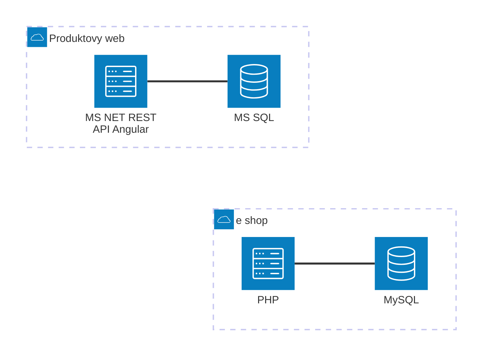
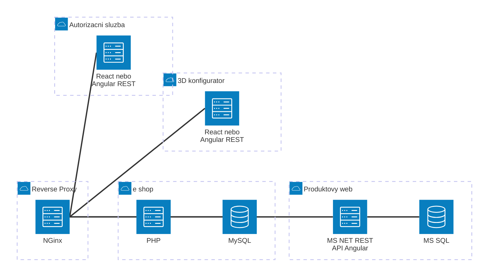

# Návrh centralizované správy uživatelů

# Zadání

Jako klient disponujeme třemi službami typu B2C (např. store.klient.com) a
klasickým prezentačním webem (klient.com). Tyto platformy fungují na různých technologiích a
každá z nich má vlastní systém správy uživatelských účtů (username a heslo). Aktuálně
připravujeme nový systém 3D konfigurátoru, ke kterému budou tito uživatelé také potřebovat
přístup.

Navrhněte způsob centralizované správy uživatelských účtů, která umožní využití
stávajících uživatelských profilů z existujících systémů pro přístup k novému 3D konfigurátoru,
bez nutnosti zakládání nového profilu do každé služby / aplikace zvlášť.

# Poznámky autora ke zperacování

- Část informací v tomto dokumentu je převzata, případně odvozena z informací v zadání, které bylo poskytnuto

# Současný stav

V současné době je cílová platforma složena z těchto systémů:

1. B2C e-shop
2. Prezentační produktový web

Dále je v záměru vyvinout 3D konfigurátor produktů.

## B2C e-shop

- Technologie: PHP (legacy řešení, převážně custom kód)
- Databáze: MySQL
- Autentizace:
  - Přihlášení pomocí e-mailu nebo uživatelského jména a hesla
  - Hesla jsou historicky ukládána pomocí různých hashovacích algoritmů (např. MD5, bcrypt)
  - Systém nepodporuje SSO ani externí identity providery

- Uživatelská data:
  - Neexistuje globální identifikátor uživatele použitelný napříč systémy
  - U části starších účtů chybí ověřený e-mail nebo jsou data nekompletní

- Technická omezení:
  - E-shop je dlouhodobě v produkčním provozu
  - Zásahy do přihlašovací logiky jsou možné pouze v omezeném rozsahu (riziko regresí)

## Prezentační produktový web

- Frontend: Angular (SPA aplikace)
- Backend: .NET REST API
- Databáze: MS SQL
- Autentizace:
  - Vlastní registrační a přihlašovací mechanismus
  - Přihlášení pomocí e-mailu a hesla
  - Moderní hashování hesel
- Uživatelská data:
  - Produktový web má samostatnou uživatelskou databázi, která je zcela nezávislá na e-shopu
  - Uživatelé si zde mohou vytvořit účet výhradně pro účely práce s obsahem (např. ukládání konfigurací, poptávek, oblíbených produktů), aniž by měli nebo potřebovali účet v e-shopu
  - V případě shodného e-mailu se stále jedná o odlišné účty v různých systémech
- Funkční využití účtu:
  - Ukládání konfigurací a poptávek
  - Přístup k personalizovanému obsahu

## 3D konfigurátor produktů - souhrn záměru budoucí aplikace

- Typ aplikace: samostatná webová aplikace (SPA)
- Technologie:
  - Frontend: moderní JavaScript framework (např. React / Angular)
  - Backend: REST nebo GraphQL API
- Požadavky na autentizaci:
  - Přístupný pouze přihlášeným uživatelům
  - Musí umožnit využití stávajících uživatelských účtů z e-shopu i produktového webu
  - **Nesmí obsahovat vlastní správu uživatelů**
- Integrace:
  - Konfigurátor bude dostupný:
    - z e-shopu (např. z detailu produktu),
    - z produktového webu,
    - případně i samostatně přes přímý vstup (URL)
- Architektonické očekávání:
  - Autentizace musí být řešena centrálně
  - Řešení má být připraveno na budoucí rozšíření o další aplikace a služby

# Výzvy a rizika

## B2C e-shop

- Je potřeba ověřit vhodnost práce eshopu s ohledem na 

# Záměr cílového stavu

Na základě současného stavu a zjištěných požadavků bude v této kapitole naznačen v obecné rovině rámcový záměr budoucího cílového stavu.

Záměr je vyvinout službu jednotného přihlášení, která bude procházet dvě báze dat uživatelských účtů a vstupní informace od uživatelů (email a heslo) proti těmto bázím ověřovat. Služba bude v případě úspěšného ověření zpřístupňovat potřebnou funkcionalitu. Z propojených služeb bude předávána URI služby v parametru **returnUrl**. Pokud předána nebude

## B2C e-shop

Vzhledem k tomu, že tento e-shop je v produkci, je tedy vysoce nežádoucí aby došlo k jakémukoli výpadku nebo nestabilitě aplikace nebo jejích procesů. Je tedy nutné tuto součást řešení ponechat beze změn.

Pro budoucí řešení je však potřeba následující:
- spolehlivě zjistit **přesný algoritmus šifrování hesel a jeho parametry**,
- zajistit propojení ostatních služeb do **MySQL** databáze e-shopu pomocí servisního uživatele pro čtení, aby bylo možné integrovat účty, které jsou zde uložené

## Prezentační produktový web

## 3D konfigurátor produktů - souhrn záměru

# Návrh jednotného přihlašovacího mechanismu

# Technické požadavky

# Uživatelská zkušenost

# Migrace a implementace

# Podrobný návrh technického řešení, včetně doporučení technologií

# Návrh postupu implementace a migrace

# Návrh na minimalizaci dopadů na uživatelskou zkušenost

Předložené řešení by mělo obsahovat:
- Analýzu současného stavu a identifikaci klíčových výzev.
- Podrobný návrh technického řešení, včetně doporučení technologií.
- Návrh postupu implementace a migrace.
- Návrh na minimalizaci dopadů na uživatelskou zkušenost.

Poznámka: Řešení by mělo zohledňovat fakt, že e-shop je klíčový pro tržby a
výpadky nebo výrazné zásahy do login procesu nejsou akceptovatelné. Nevyžaduje se detailní
technická implementace ani kód, důraz je kladen na architekturu, postup a zdůvodnění návrhu.
